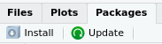
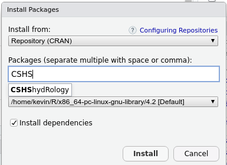

```{r setup, include=FALSE}
knitr::opts_chunk$set(echo = TRUE)
```
# Welcome!

Thank you for attending the CSHS Workshop: **R for hydrologists**.

This is the first of 2 sets of instructions that you will receive. The second set
will show you how to download the working files for the workshop.

The workshop will be interactive and will consist of the following sessions:  

**Morning**  
Introduction to R - Kevin Shook  
--------------------------  
  Coffee break  
--------------------------  
Working with **CSHShydRology** - Paul Whitfield  
==========================  
  Lunch (not provided)  
==========================  
**Afternoon **  
Catchment delineation - Dan Moore  
--------------------------  
  Coffee break  
--------------------------  
Functions, projects and packages - Kevin Shook  
Writing your own functions - Paul Whitfield  
Creating documents in RMarkdown - Dan Moore  


# Setup instructions - part 1

As this is a workshop, you will need a laptop with **R** and **Rstudio** pre-installed.
We won't have time to help you with the installation, so please make sure that
your system is working ahead of time. This is especially important if you have a
computer from your employer - please talk to your IT people ahead of time to make sure that
everything is installed correctly.

## Installing **R**

**R** needs to be installed first. You can get the program here:
https://cran.r-project.org/index.html

Next, you need to install **RStudio**. You can get it from here:
https://www.rstudio.com/products/rstudio/


Please run **RStudio** _before_ attending the workshop to be sure that everything
is working properly.

## Installing `CSHShydRology`

The Workshop is based on the `CSHShydRology` package, so you will need to have it
installed ahead of time. You can do this inside **RStudio** by selecting the
**Packages** tab and clicking the "Install" button. 
{width=20%}  
Now type "CSHShydrology" into the dialog box. Make sure that the checkbox
"Install dependencies" is selected and click the **Install** button.  

{width=40%}

## Other programs and packages

### whitebox

`CSHShydRology` requires the use of the package `whitebox`.
It should have been installed as a dependency when you installed `CSHShydRology`.

`whitebox` also requires an executable program to be installed. 
After the `whitebox` package is installed, you can install
the executable program inside **RStudio** with the following commands:

```{r, echo = TRUE, eval= FALSE}
library(whitebox)
install_whitebox()
```


### ggplot2
The package `ggplot2` is used very widely for graphs. We have a few exercises which
use it, so it would be a good idea to install it. It is installed in the
same as was `CSHShydRology`.

### rmarkdown
We will be using the package `rmarkdown` to create documents, so you should
also install it. This allows you to create html documents. If you want to
be able to export .pdf and .docx files, you will also need to install the program
**Pandoc**  <https://pandoc.org/installing.html>
and **LaTeX**. Note that the **Pandoc** installation page also shows where you can obtain
**LaTeX** for your system.

### git
**git** is a distributed version control program. We will be showing how to
use **git** with **RStudio** to manage the versions of your files. You can
install **git** from here: <https://git-scm.com/downloads>.

### devtools
We will be showing how you can build packages in **R**, which requires installing
the package `devtools`. Make sure that all the dependencies (there are many!) 
are installed.

### GitHub
**GitHub** is a web site which works with **git** to share versions of files
among people. It is very widely used in software development, including by
the developers of `CSHShydRology`. In the next set of instructions, we will
show you how to download the files needed for the workshop from **GitHub**. Therefore 
you must first set up a **GitHub** account. The account is free of charge.
You can register for **GitHub** at:
<https://github.com/>.
