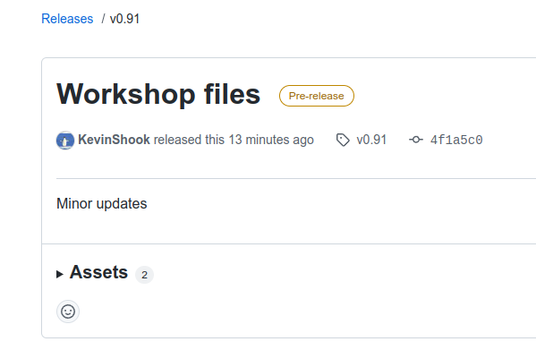
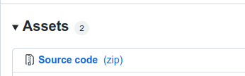

```{r setup, include=FALSE}
knitr::opts_chunk$set(echo = TRUE)
```
# Welcome!

Thank you for attending the CSHS Workshop: **R for hydrologists**.


# Setup instructions - part 2


# Setting up your workspace

The data files needed for these exercises can all be downloaded from **GitHub**,
at <https://github.com/CSHS-CWRA/CWRA_2022_R_workshop>. 
Note that to get the files you _must_ have an account on **GitHub**, which is free.

To get the data, follow the steps below.
Note that the files are subject to change (we are working on the content), so it's
a good idea to check to see if the files have been updated.  

1.  Go to <https://github.com/CSHS-CWRA/CWRA_2022_R_workshop/releases>  
You will see the current version number of the files. In the case shown here, it's version 0.91,
which is a pre-release version.
The version(s) used by the workshop will be >= 1.0.  

{width=50%}  

2.  Click on the triangle to the left of **Assets**  
3.  Under **Assets** click on **Source code (zip)**  
{width=30%}  
4.  Download the .zip file to a folder on your hard drive.  
5.  Extract the .zip file  

This will create all of the folders that are required, with all of the data files
that we will be using.

`/tutorials`  - contains the tutorials that you will be working through  
`/slides`  - contains all the slide presentations  
`/data` - contains all the data sets required to complete the exercises  
`/output` - where your code will write output  
`/figures` - where your code will save figures  
`/preparation_instructions` - this document  


