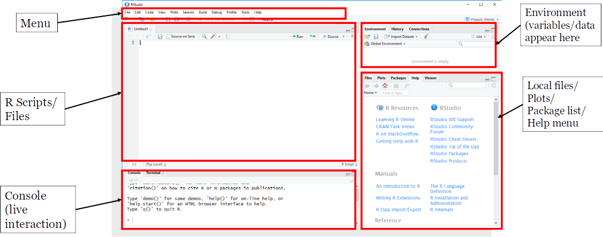
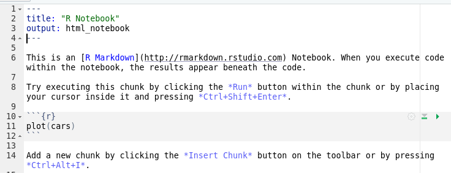

```{r setup, include=FALSE}
knitr::opts_chunk$set(echo = FALSE)
```


## Introduction

- This workshop is intended for all users of hydrological, hydrometric and
other environmental data
- We don't assume any background in **R**
- The workshop will consist of several different topics
  - each will be introduced with a short slide presentation
  - followed by a tutorial for you to work through step by step  
  
  
## CSHShydRology
- The workshop is based on the new **R* package `CSHShydRology`
- Developed by Canadian hydrologists for Canadian users
  - works with Canadian data sets
  - provides a "home" for Canadian hydrological **R** code  
  

## Getting started
- This workshop requires that you have installed
  - **R**
  - **RStudio** - IDE for R
  - `CSHShydRology` - also requires many other packages to be installed
  
## What is R?

- A command-line program
- A programming language
- _Much_ more than a statistics program
- A general-purpose scientific program

## Why "R"?

- S-plus is a proprietary statistics program
  - used the S language
- R is a Free Open Source Software (FOSS) implementation of the S language
- Developed by Ihaka and Gentleman in 1996:

Ihaka, R., Gentleman, R., 1996. R: A Language for Data Analysis and Graphics. Journal of Computational and Graphical Statistics, vol. 5, no. 3, p 299–314.

- Now one of the most used computer languages in the world

## Why use R?

- Powerful
- Excellent for
  - statistics
  - data processing
  - graphing
  - analysis, including GIS
  
- Free Open Source Software (FOSS)  
  - you can see, test, and trust the code
  - no licensing issues
  - works with standard file formats - no lock in 
  - rapid development, widely used 
    - huge amount of resources available
  
## Why use R? (continued)

- Works well with other programs
  - interfaces with other languages including C, C++, Python and Fortran
  - can read/write Excel files directly using packages like **xlsx**
  - can read many other files such as netcdf, shapefiles, databases

- Platform independent
  - works the same on Windows, MacOS and Linux
  
- Makes your work **reproducible**


## R is great for hydrology!

- Data wrangling
  - acquiring and formatting data
- Model pre- and post- processing
- Statistical analyses
- "Big data" processing
- Machine learning models
- Publication quality graphing
- GIS
- many, many more

## Packages

- **R** has thousands of built in functions
- Many more are available as downloadable packages
- Each package contains:
  - functions
  - documentation
  - sample data
  - working examples
- Packages are downloaded directly through **R**
  - very easy, handles all dependencies

## CRAN packages
- Most packages are stored at **CRAN** (Comprehensive R Archive Network)  
cran.r-project.org
- Very rigorous submission process
  - high quality packages
- Number of packages is growing exponentially - currently > 18,000
- Very easy to install in **R**

Example  

`install.packages("ggplot2")`

## Opening RStudio
{width=100%}  

## Working with notebooks
- Notebooks are the best way to work with **R**
- Allow you to work interactively
  - they save your work so you can see it later
  - they also let you document your work
- R code is stored in chunks
  - each chunk can be run separately, or together
  - click on the green arrow to execute each chunk
  


## Loading and creating notebooks
- To load a Notebook, double-click on the file or
  - select **File|Open File**
- To create a new Notebook
  - select **File|New File|R Notebook**
  - will create a skeleton Notebook containing text and chunks of **R** code
  - remember to save the Notebook!

- When all the code is working, click on the Knit button to run the whole Notebook
and create the output


## Basic R tasks
The file `Introduction_to_R_Tutorial.Rmd` contains exercises to
work through. 

- If you haven't used **R** very much, start at the beginning
- If you are finding these too easy, skip to the **Advanced R** section

## How to run the tutorials
You can either 

- execute each line one at a time by putting your cursor in the line and hitting [Ctrl][Enter] 
- execute each chunk separately by clicking on the green arrow button

When you are finished, you can `knit` the tutorial. You will get a .pdf
which will be a useful reference.

## Getting help
- There is a lot of help in **RStudio**
- For online help, use <https://rseek.org/.>
- Check the R reference card in the `/data` directory

## Suggested options
- In **Tools | Global Options** enable _all_ **R Diagnostics** under "Code" 
- Will check for errors and will nag you about your code style   

{width=40%}


