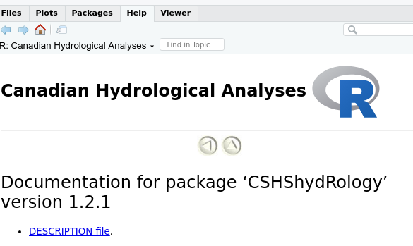

```{r setup, include=FALSE}
knitr::opts_chunk$set(echo = FALSE)
```

## Efficiency, safety and reproducibility

- Objectives of this presentation and exercises
- Want to make you a better **R** user
- Will show you tools that
   - will make you more efficient
   - make your work safer
   - make your code more reproducible

## Functions

- Very important for efficiency, safety and reproducibility
- Once a function has been debugged and tested, you can use it with some confidence
- **R** has a built-in debugger which only works with functions
- Always a very good idea to have someone else check your code
  - functions make this much easier
- Functions work very well with Notebooks
- Functions are only way of putting code into packages
  
## Debugger
  

## Function documentation
- It's critical that you document what your function does
- You won't be able to remember in the future
- No-one likes writing documentation, but it needs to be done
- If you have **devtools** installed then you can use `roxygen` to
insert a skeleton for the documentation
  - once skeleton is created, you can edit the tags
  - **roxygen** tags are used by **R** to create package documentation
- Still need to add comments to describe what your code is doing

## Exercise
- Load the file "f2c.R" into your workspace
- Place your cursor anywhere inside the function
- Click on **Code | Insert Roxygen Skeleton**
```{r eval = FALSE, echo = TRUE}
#' Title
#'
#' @param temp_f 
#'
#' @return
#' @export
#'
#' @examples
f2c <- function(temp_f) {
  temp_c <- (temp_f - 32) / 1.8
  return(temp_c)
}
```

## Projects
- A project is a collection of **R** files 
- Has its own directory
- Increases efficiency, safety and reproducibility
- Can have its own set of options

## Why create a project?
- Makes your code more reproducible
- Keeps code separate from other projects
- Lets your code work with `git` and GitHub or GitLab
  - a very good idea for code safety and reliability 
- Basis for creating packages


## How to create a project
- Command is **File | New Project**
- Several alternatives appear

{width=50%}


## Decisions, decisions....
- New Directory  
   - allows you to create any type of project, including packages 
   - can use **git** (always a good idea), _but_
   - _won't_ work with **GitHub**
  
- Existing Directory  
   - only creates a simple project
   - doesn't set up **git**, but you can add it later
   - _won't_ work with **GitHub**

- Version Control  
    - clones a project from a repository like **GitHub** or **GitLab**
    - project has to be set up on the repository _first_


## .Rproj file
- Every project contains a project file (`project_name.Rproj`)
  - a text file which contains the project settings
- Double-clicking on the file in your file manager will load **RStudio** with
the project
    - default directory will be set to the project directory
- Can also load a project manually in **RStudio** using  
**File | Open Project** or   
**File | Recent Projects**
- You can only have one project open at a time
  - opening a project will close your current project
  
## git
- **git** is a program for version control 
- Created by Linus Torvalds (creator of Linux)
- Allows you to manage versions of your documents
- **RStudio** allows you to do most operations without typing commands
  - if you screw up, you _will_ have to type **git** commands
- Can sync with **GitHub**

## Working with git
- **git** is based on _branches_
  - each branch is a separate set of files
- There is always a **main** (or **master**) branch
  - best version of the files
- When a branch is ready, it can be merged into the **main** branch
- You can switch between branches at any time

## git branches
- _ALWAYS_ create a new branch before working on a project
  - if you don't it will be a huge PITA
- Click on **New Branch** button in the **Git** tab  
{width=50%}

## Committing
- When you have finished some work, you can commit your changes by 
 - selecting the files to commit and 
 - clicking on **Commit** in the **Git** tab
- You will then see a window which lets you review your changes
- You **must** type a Commit message describing your changes before clicking
on the Commit button  
{width=50%}


## Exercise
- Note - this can't be done on Rstudio Cloud
- Create a new project in a new directory
- Check "Create a git repository"
- Don't check "Use renv with this project"
  - **renv** is a package which keeps copies of all of the packages that you use with the project
- Quit **RStudio**
- Copy the file "f2c.R" to the project directory
- Copy the file "Introduction_to_R_Tutorial.Rmd" to the project directory
- Go to your file manager and double-click on the ".Rproj" file in the new directory
  - you should now see "f2c.R" in the Files tab
- Create a new branch in the Git tab
  - load "f2c.R"
  - make an edit to the file "f2c.R"
  - commit the change
  
- In **RStudio** click on **File | Recent Projects** to re-load _this_ project


## GitHub/GitLab

- You can sync your project with an online repository at GitHub or GitLab
- Have to set up the online repo _first_
  - need an account (which you should have)
  - have to have **ssh** set up on your computer, and to tell GitHub your **ssh** key
- When you create a project, you select Version Control and then indicate the source to clone from

{width=40%}  {width=40%}  

## Example exercise
- This can't be done on RStudio Cloud
- Create a local copy of the workshop project
git@github.com:CSHS-CWRA/CWRA_2022_R_workshop.git

- If you are using the RStudio Cloud, you are already
using the project


## **R** Packages
- **R** packages are a special type of project
- Only hold functions - do _not_ use them for Notebooks
- Great for distributing your work to others
- Also useful for making your own work more reproducible
- _Must_ contain documentation for all functions
- Can also contain test data sets

## Why create a package?
- The best way to distribute **R** code
- Makes your code reproducible
  - makes code reusable
- Improves code quality
- Takes care of dependencies
- Self-documenting
- Should work for anyone, on any computer

## Building a package
- All components are text files
  - You could build them manually
- **DON'T!**
- Use the package **devtools**
  - makes it *much* easier
- Need packages **roxygen2**, and **rmarkdown**
- Need LaTex installed to create manuals
- Also, make sure to have **git** installed on your system

## Mandatory package components
- 2 Files
  - DESCRIPTION
  - NAMESPACE
- 2 directories are mandatory
  - `/R`   -- contains code .R files
  - `/man`  -- contains documentation .Rd files
- may have other directories  
  
## DESCRIPTION
- Contains package description
- Has to have a specific format
- Has to indicate the packages required by your package
- You can see the DESCRIPTION file for any package on your system

## Exercise
- In the Packages tab, click on **CSHShydRology**
- Then select the **DESCRIPTION file**  
{width=50%}  


## NAMESPACE
- Contains detailed information about imports and exports of each function
- Do NOT create or edit this file
  - **roxygen2** will automatically create and maintain it

## R directory
- Contains the **R** code
- Code must be written as functions
- Each function must be in a separate file
  - file name is same as function name
  - file extension must be **.R**

## man directory
- Contains the documentation files
- Creates the help system for the package
- Also creates the manual
- Each .R file has a .Rd file in **man**
  - Don't create these files manually

## roxygen2
- Used by **devtools**, installed by it
- Automatically creates the .Rd files
  - uses comments at the beginning of each **.R** file

## Example

- All lines begin with `#`
- First line contains a 1 line description of the file
- Should not end with a period!


## Tags

```{r, eval=FALSE, echo =TRUE}
#' @description - optional multi-line desciption  
#' @param - required for each parameter  
#' @return - required, specifies return value of function    
#' @author - optional, lists author  
#' @export - required if function is accessible outside your package
#' @examples - required, a working example
```

## Formatting
- Documentation can include formatting codes
```{r ,eval=FALSE, echo =TRUE}
\pkg{} - package
\option{} - option
\emph{} - emphasis
\code{} - code
```

## Example
```{r, eval=FALSE, echo =TRUE}
#' Calculates quantile values for a Quantile-Quantile plot   
#' @description The built-in \code{qqplot} function does not work with \pkg{ggplot2}. This just calls the qqplot function to caclulate the quantiles without plotting them.  
#' @param x Required. A numeric vector.  
#' @param y Required. A numeric vector.   
#' @return Returns a dataframe with the quantiles of x and y.  
#' @author Kevin Shook  
#' @export  
#' @examples  
#' quantiles <- qqplotValues(runif(20), runif(50)) 
```


## Package function
- You should create a function that has the name of your package
- Example: CSHShydRology-package.R
- Gives overview of the package and what it's for
- Contains information to create NAMESPACE

## Other folders

- You may see these folders in packages:
  - /data, data files used by the package
  - /vignettes, documentation written in Markdown
  - /inst, contains the file CITATION showing how to cite the package
  - /src, source code written in C, C++ or Fortran


## Workflow
1. Create the package
2. Add code
3. Build package
4. Check package
5. Create package file

## 1. Creating the package

- Create a new project in a new directory  
  - **File|New Project**
  - select **R Package**
  - then give your package a name and a location  
- Make sure to use **git**!  
{width=50%}

## New package
- **Rstudio** will create all of the files and directories
  - `/R`
  - `/man`
  - `DESCRIPTION`
  - `NAMESPACE`
- Also creates a sample file **hello.R** in `/R`
- Adds folders and files for **git**

## Setting up roxygen
- Not enabled by default
- Set it up using **Tools|Project Options** 

{width=50%}  

## Set roxygen options
- Configure to run automatically  
{width=50%}  

## 2. Adding R code
- Put your R code files in /R
- Must be functions
  - one function per file
- Add the roxygen skeleton to your code for each file
  - **Code|Insert Roxygen Skeleton**
- Fill in skeleton


## Converting your R code
- You will ned to make some changes to your code
- Don't use the **library()** function to load packages
  - package importation handled by `NAMESPACE`
- Specify the name of the package in every function (outside of your package and Base R) call
  - syntax is **package::function**
  
```{r, eval=FALSE}
  p <- ggplot2::ggplot(df, ggplot2::aes(x, y))
```

## 3. Building package
- Use command **Build | Clean and Rebuild**
- Expect to get error messages!
- Fix until package builds
- If the package builds, it will be added to your list of packages

## 4. Checking the package
- Just because a package can build, doesn't mean that it is good!
- Use command **Build|Check**
  - does a detailed check of entire package
  - can be slow for large packages
  - tries to run your examples
  - *very* picky
  - you will probably get many, many errors, warnings and notes at first
  - eliminating all warnings and notes really improves your code

## 5. Creating the package file
- 2 options:
  - **Build | Build Source Package** - contains source code (all languages)
  - **Build | Build Binary Package** - contains compiled Fortran, C, C++ code
- Reason is that Windows computers usually don't have compilers
- If just using **R** code, make it a source package
- If you are using Fortran, C, C++, create both types

## Building the manual .pdf
- When the package is built, should also create the .pdf
- Must have LaTex installed
- For some reason, this doesn't work for me
  - have to do it manually
  - type in this command in the **R** console:
  
```{r, eval=FALSE, echo = TRUE}
system("R CMD Rd2pdf mypackage")
```

## Unit tests
- New feature, part of **devtools**
  - tests the results of functions
  - compares function outputs to known values
  - allows automated testing of functions

  
## Exercise
- Create a package from scratch
- Build the package
- Copy some functions into the `/R` directory
- Add the **roxygen** skeleton to the functions
- See if you can get the package to build properly


## Summary
- Learning to code in functions will take some time but is worth the investment
  - improves your code quality
  - makes code more reliable
  - makes _you_ more efficient
- Creating an **R** project should be your first step when starting a new task
- Creating your own **R** packages, when using **git**, is the ultimate way to ensure efficiency, safety and reproducibility

