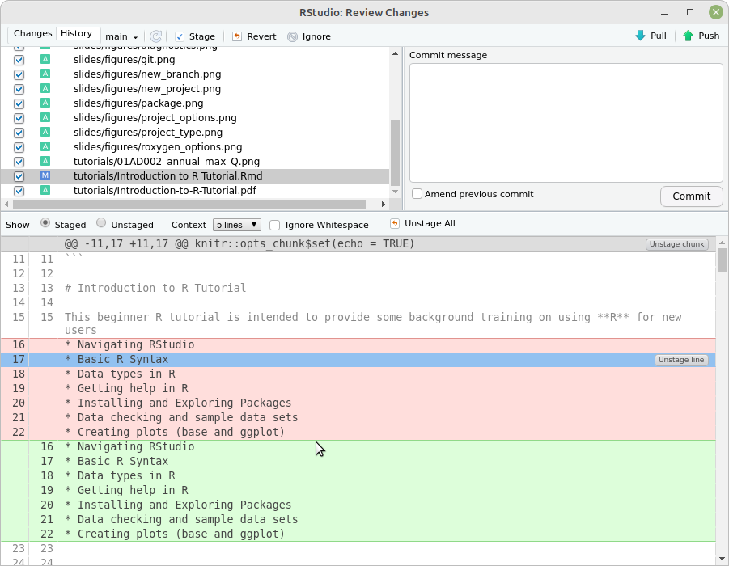

```{r setup, include=FALSE}
knitr::opts_chunk$set(echo = FALSE)
```


## Why create a project?
- Makes your code more reproducible
- Keeps code separate from other projects
- Lets your code work with `git` and **GitHub**
- Basis for creating packages


## How to create a project
- Command is **File | New Project**
- Several alternatives appear

{width=50%}


## Decisions, decisions....
- New Directory  
   - allows you to create any type of project, including packages 
   - can use **git** (always a good idea), _but_
   - _won't_ work with **GitHub**
  
- Existing Directory  
   - only creates a simple project
   - doesn't set up **git**, but you can add it later
   - _won't_ work with **GitHub**

- Version Control  
    - clones a project from a repository like **GitHub** or **GitLab**
    - project has to be set up on the repository _first_


## .Rproj file
- Every project contains a project file (`project_name.Rproj`)
  - a text file which contains the project settings
- Double-clicking on the file in your file manager will load **RStudio** with
the project
    - default directory will be set to the project directory
- Can also load a project manually in **RStudio** using  
**File | Open Project** or   
**File | Recent Projects**
- You can only have one project open at a time
  - opening a project will close your current project
  
## git
- **git** is a program for version control 
- Created by Linus Torvalds (creator of Linux)
- Allows you to manage versions of your documents
- **RStudio** allows you to do most operations without typing commands
  - if you screw up, you _will_ have to type **git** commands
- Can sync with **GitHub**

## Working with git
- **git** is based on _branches_
  - each branch is a separate set of files
- There is always a **main** (or **master**) branch
  - best version of the files
- When a branch is ready, it can be merged into the **main** branch
- You can switch between branches at any time

## git branches
- _ALWAYS_ create a new branch before working on a project
  - if you don't it will be a huge PITA
- Click on **New Branch** button in the **Git** tab


## Committing
- When you have finished some work, you can commit your changes by 
 - selecting the files to commit and 
 - clicking on **Commit** in the **Git** tab
- You will then see a window which lets you review your changes
- You **must** type a Commit message describing your changes before clicking
on the Commit button



## Exercise
- Create a new project in a new directory
- Check "Create a git repository"
- Don't check "Use renv with this project"
  - **renv** is a package which keeps copies of all of the packages that you use with the project
- Quit **RStudio**
- Copy the file "f2c.R" to the project directory
- Copy the file "Introduction_to_R_Tutorial.Rmd" to the project directory
- Go to your file manager and double-click on the ".Rproj" file in the new directory
  - you should now see "f2c.R" in the Files tab
- Create a new branch in the Git tab
  - load "f2c.R"
  - make an edit to the file "f2c.R"
  - commit the change
  
- In **RStudio** click on **File | Recent Projects** to re-load _this_ project


## GitHub

- You can sync your project with an online repository at GitHub or GitLab
- Have to set up the online repo _first_
  - need an account
  - have to have `ssh` set up on your computer
- When you create a project, you select Version Control and then indicate the source to clone from

{width=40%}  {width=40%}  


